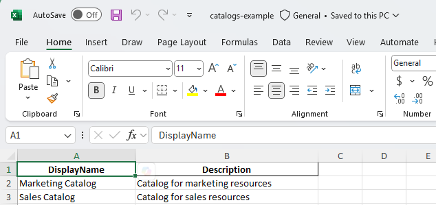
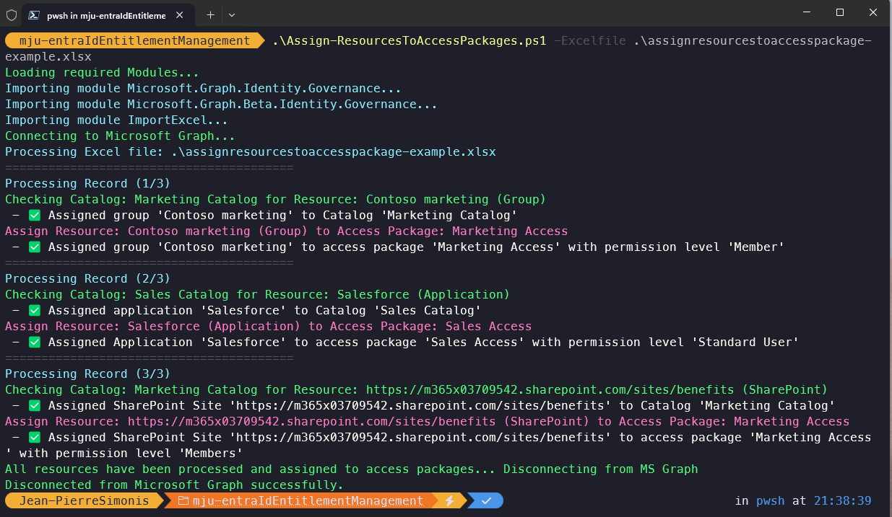

# Entra ID Entitlement Management Automation

This repository provides PowerShell scripts to automate the management of Microsoft Entra ID (Azure AD) Entitlement Management. The scripts use Excel files as input for bulk operations, making it easy to create catalogs, access packages, assignment policies, and assign resources at scale.

**Table of Contents**
- [Entra ID Entitlement Management Automation](#entra-id-entitlement-management-automation)
  - [1. Excel File Imports](#1-excel-file-imports)
    - [1.1 catalogs-example.xlsx](#11-catalogs-examplexlsx)
    - [1.2 accesspackages-example.xlsx](#12-accesspackages-examplexlsx)
    - [1.3 assignresourcestoaccesspackage-example.xlsx](#13-assignresourcestoaccesspackage-examplexlsx)
  - [2. PowerShell Scripts](#2-powershell-scripts)
    - [2.1 Create-EntitlementCatalogs.ps1](#21-create-entitlementcatalogsps1)
    - [2.2 Create-EntitlementAccessPackages.ps1](#22-create-entitlementaccesspackagesps1)
    - [2.3 Assign-ResourcesToAccessPackages.ps1](#23-assign-resourcestoaccesspackagesps1)
  - [3. Prerequisites](#3-prerequisites)
  - [4. Getting Started](#4-getting-started)
  - [5. Support](#5-support)
  - [Thanks](#thanks)

## 1. Excel File Imports

Each script uses an Excel file as input. The required columns and their meanings are described in the `.DESCRIPTION` section of each PowerShell script. Please refer to the top comments in each script for detailed column definitions and examples.

> **Tip:** Use the provided example files as templates. Ensure all required columns are present and data is accurate before running the scripts.

### 1.1 catalogs-example.xlsx

Used by `Create-EntitlementCatalogs.ps1` to define catalogs.

**Excel column definitions:**

    DisplayName – Name of the catalog
    Description – Description of the catalog

  

### 1.2 accesspackages-example.xlsx
Used by `Create-EntitlementAccessPackages.ps1` to define access packages and assignment policies.

This excel import allows for the creation and assignment of access packages to catalogs, assigment of a group that can access package and the automated creation of access package policies.

**Access Packages policies** that can be created on single access package

- Auto-Assignment Policies
- Approval Enabled Policies with or without Access Reviews
- Both of the above

**Excel column definitions:**

    AccessPackageName – Name of the access package
    Description – Description of the access package
    CatalogName – Display name of the catalog (resolved to ID in script)
    PolicyName – Name of the assignment policy
    PolicyDescription – Description of the policy
    ApprovalEnabled – True or False, whether approval policy is required for access requests
    Approver - UPN of the user or Display Name of the group that will approve requests for this access package
    ApproverType - "user" or "group"
    EscalationApprover - UPN of the user or Display Name of the group that will approve escalation requests for this access package
    EscalationApproverType - "user" or "group" 
    DurationInDays – Leave blank for no expiration
    AutoAssignmentEnabled – True or False, whether auto-assignment policy is required for access requests
    DynamicMembershipRule – Dynamic membership rule for the group if AutoAssignmenEnabled (optional) eg (user.department -eq "Department X") 
    TargetGroupName – Group display name (resolved to ID in script)
    IsHidden – True or False (whether the access package is hidden from users)
    AccessReviews - True or False, if set to true, access reviews will be created for the access package.


### 1.3 assignresourcestoaccesspackage-example.xlsx

Used by `Assign-ResourcesToAccessPackages.ps1` to define which resources are assigned to which access packages.

**Supported Resource Types**

- **Group** Entra ID Group or Microsoft Team
- **Application** Entra ID Enterprise Application
- **SharePoint** SharePoint Online Site

**Supported Permission level values**

- **Group:** Owner, Member
- **Application:** Default, Whatever application roles are configured on your Entra ID Enterprise App Registration
- **SharePoint:** Owners, Members, Visitors

**Excel column definitions:**

    AccessPackageName – Name of the access package
    ResourceName – Name of the resource (e.g., Group Display Name, Enterprise Application Display Name, SharePoint site URL)
    ResourceType – Type of resource (Group, Application, SharePoint)
    PermissionLevel – Role or permission level (e.g., Owner, Member, Reader)

  

## 2. PowerShell Scripts

### 2.1 Create-EntitlementCatalogs.ps1
- **Purpose:**
  - Creates entitlement management catalogs in Entra ID Entitlement Management using data from an Excel file.
- **Usage:**
  - Run the script and provide the path to your populated Excel file.
  - Example:
  
    ```powershell
    powershell.exe -executionpolicy bypass -file .\Create-EntitlementCatalogs.ps1 -ExcelFile ".\catalogs-example.xlsx"
    ```

  - Example with log to file:
  
    ```powershell
    powershell.exe -exectuionpolicy bypass -file .\Create-EntitlementCatalogs.ps1 -ExcelFile ".\catalogs-example.xlsx" -LogtoFile
    ```

  

### 2.2 Create-EntitlementAccessPackages.ps1

- **Purpose:**
  - Creates access packages and assignment policies in Entra ID Entitlement Management using data from an Excel file.
  - Handles approval workflows, access reviews, and expiration policies as defined in the Excel file.
- **Usage:**
  - Run the script and provide the path to your populated Excel file.
  - Example:
  
    ```powershell
    powershell.exe -executionpolicy bypass -file .\Create-EntitlementAccessPackages.ps1 -ExcelFile ".\accesspackages-example.xlsx"
    ```

  - Example with log to file:
  
    ```powershell
    powershell.exe -executionpolicy bypass -file .\Create-EntitlementAccessPackages.ps1 -ExcelFile ".\accesspackages-example.xlsx" -LogtoFile
    ```

  


-%20Entra%20ID%20Portal.png)  

-%20Entra%20ID%20Portal.png)  

### 2.3 Assign-ResourcesToAccessPackages.ps1

- **Purpose:**
  - Assigns resources (such as groups, applications, or SharePoint sites) to Entra ID Entitlement Management access packages as defined in an Excel file.
  - Ensures resources are present in the catalog before assignment.
- **Usage:**
  - Run the script and provide the path to your populated Excel file.
  - Example:
  
    ```powershell
    powershell.exe -executionpolicy bypass -file .\Assign-ResourcesToAccessPackages.ps1 -ExcelFile ".\assignresourcestoaccesspackage-example.xlsx"
    ```

  - Example with log to file:
  
    ```powershell
    powershell.exe -executionpolicy bypass -file .\Assign-ResourcesToAccessPackages.ps1 -ExcelFile ".\assignresourcestoaccesspackage-example.xlsx" -LogtoFile
    ```

  

  

  


  

## 3. Prerequisites

- PowerShell 7+
- Required modules:
  - `Microsoft.Graph.Identity.Governance`
  - `Microsoft.Graph.Beta.Identity.Governance` (for some resource assignments)
  - `ImportExcel`
- Appropriate permissions in Microsoft Entra ID (Azure AD)
- Entra ID Governance licensing

## 4. Getting Started

1. Populate the Excel files with your catalog, access package, and resource assignment data. Refer to the `.DESCRIPTION` section in each script for required columns and examples.
2. Run the scripts in the following order:
   1. `Create-EntitlementCatalogs.ps1`
   2. `Create-EntitlementAccessPackages.ps1`
   3. `Assign-ResourcesToAccessPackages.ps1`
3. Review script output for any errors or warnings.

## 5. Support

For questions or issues, please open an issue in this repository.
v
## Thanks

This work was inspired and built from the great work of Christian Frohn.

[Christian's Frohns Github](https://github.com/ChrFrohn/Entra)
[Christian's website](https://www.christianfrohn.dk/category/microsoft-entra/)
